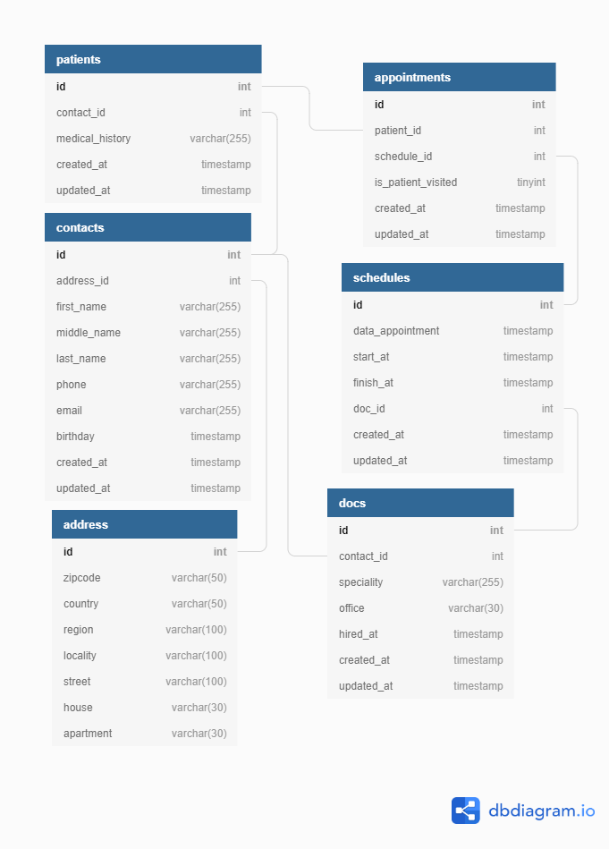

# Проект "H": 
# Актуальний розклад та онлайн запис на прийом до лікарів

`Веб-сайт проекту в інтернеті`:  (https://appntmnt.herokuapp.com/)

## Що таке, це "H"?

"**Н**" - це перша літера в англійському слові "**Hospital**" (лікарня).  

Цей проект - мій особистий вклад в боротьбу с епідемією **COVID-19**.  

Його мета - дати змогу лікарям та їх пацієнтам витрачати більше часу на, саме, процес лікування, а не на бюрократичну волоченю.  

Код проєкту має ліцензію **MIT** та розміщений на публічному репозиторії `https://github.com/vladar21/timetable`.  

Ліцензія **MIT** (англ. **MIT License**) — група ліцензій, розроблених Массачусетським технологічним інститутом для розповсюдження вільного програмного забезпечення.  

Запрошую **всі медичні заклади**, незалежно від їх організаційно-правової форми та форми власності, **безкоштовно** використовувати цей програмний продукт у своєї діяльності.  

Запрошую до участі у проєкті на принципах волонтерства та взаємодопомоги всіх, хто поділяє ідеї проєкту і має достатній для його цілей рівень програмування.  

Ваші пропозиції прошу направляти на електронну адресу `vlad.rastvorov@outlook.com`  

## Стек технологій

[PHP феймворк Codeigniter 4](https://codeigniter.com/user_guide/intro/index.html) - популярний MVC фреймворк з відкритим кодом.  

[Tailwind CSS 2](https://tailwindcss.com/) - це "**utility-first**" ("корисність насамперед") **CSS-фреймворк**, що пропонує великий каталог класів і інструментів для полегшення стилізації сайту або програми.  

[jQuery](https://jquery.com/) — популярна **JavaScript**-бібліотека з відкритим кодом.

[FullCalendar 5](https://fullcalendar.io/) - це **jQuery** плагін, який може використовувати всім відому технологію **AJAX**. Він має широкі функціональні можливості, легкий в конфігурації, працює з більшістю форматів дати і часу.  
Так само, **FullCalendar** є плагіном з відкритим вихідним кодом під ліцензією **MIT**.  

[PostgreSQL](https://www.postgresql.org/) - це об'єктно-реляційна система управління базами даних (**ОРСУБД**, **ORDBMS**), заснована на **POSTGRES**, Version 4.2 - програмою, що була розроблена на факультеті комп'ютерних наук **Каліфорнійського університету в Берклі**.
Завдяки вільної ліцензії, **PostgreSQL** дозволяється безкоштовно використовувати, змінювати і поширювати всім і для будь-яких цілей - особистих, комерційних чи навчальних.  

[GIT](https://git-scm.com/) - розподілена система керування версіями файлів та спільної роботи, яка поширюється безкоштовно та робить можливим ефективну командну роботу над проєктом.  

[GitHub репозиторий](https://github.com/vladar21/timetable) - це безкоштовний онлайн сервіс для зберігання коду та його управлінням за допомогою **GIT**.  

[Heroku](https://heroku.com) - це хмарна PaaS платформа, яка була використана разом с GitHub для організації автоматичного розгортання ("automatic deploys from GitHub"), управління та масштабування веб-сайту проєкту.  

## Який функціонал вже зроблено

Розроблена база даних  

Миграція та сiдiнг бази даних.

Реєстрація та авторизація.  

Валідація для реєстраційної форми.  

Транзакційний запис до бази даних нових пацієнтів.  

Адаптивний веб-дизайн (Responsive web design).  

Промо-сторінка.  

Оповіщення та повідомлення для **user**.  

Онлайн графік лікарні на рік, місяць, тиждень та добу.  

Запис та скасування запису пацієнтів до лікарів одним кликом.  

## Цо планується зробити

Додати в базу даних таблицю "ролі", та переробити код з урахуванням цього.

Додати адмін частину.

Додати в адмін частину реєстрацію лікарів в базі даних.

Додати на сторінку календар функціонал для формування лікарем свого розпорядку в один-два кліка.

Фільтри для пацієнтів за спеціалізацією лікарів.  

Автоматичну відправку пацієнту інформації про всі його діючи записи до лікарів, після того, як він виходить з акаунту.  

Інтеграція з Гуггле календарем.  

Допрацювати базу даних додавши таблицю "медичний заклад".

Додати в адмін частину внесення даних сутності "медичний заклад".

Додати в фільтр для пацієтів вибір медичного закладу.

Зробити API для інтеграції даних ресурсу в інші проєкти.

## Установка та запуск проекту

Клонуйте проєкт за допомогою командної строки або Bash:  
`git clone https://github.com/vladar21/timetable.git`

Створить `.env` файл с вашим базовим `url` та конфігурацією бази даних проекту.  

Створить базу даних, якщо її нема.  

Виконайте команду:  
`composer install`

Для створення необхідних для проєкту таблиць в базі даних виконайте команду:  
`php spark migrate`

Якщо ви бажаєте отримати зразок вже заповенної бази даних, то виконайте команду:  
`php spark db:seed StartSeeder`. Пароль для всіх контактів `password`.  

Для запуску веб-сайту проекту налаштуйте ваш віртуал хост, або виконайте команду:  
`php -S localhost:9090`

## Вимоги до середовища проекту

PHP версії 7.2 або вищу з наступними розширеннями:

- [intl](http://php.net/manual/en/intl.requirements.php)
- [libcurl](http://php.net/manual/en/curl.requirements.php)
- json (як правило, цей інструмент є по умовчанню)
- [mbstring](http://php.net/manual/en/mbstring.installation.php)
- [mysqlnd](http://php.net/manual/en/mysqlnd.install.php)
- xml (як правило, цей інструмент є по умовчанню)

